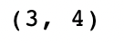
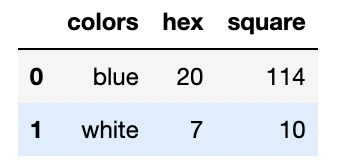

# Liopard

Liopard is a easy-to-use python libarary allow you to work with relational/labeled data. It has basic functionalities to perform data analysis including reading from csv file, getting properties, flexible selection, common manipulation, arithmetic operation, aggreagation/non-aggregation methods, creating pivot table of the data.

# Install

`pip install liopard`

# Example

You can use the `Test Notebook.ipynb` jupyter notebook to manually or run `pytest` to automatically test the library. Below shows some examples to use the API.

## Reading from csv file

`import liopard as liop`

`df = liop.read_csv('data/employee.csv')`

## Getting properties

```
name = np.array(['Tom', 'Jerry', 'John'])
movie = np.array(['Sonic', 'Accountant', 'Doctor Strange'])
paid = np.array([True, False, True])
cost = np.array([20, 5, 80])
data = {'name': name, 'movie': movie, 'paid': paid, 'cost': cost}
```

`df.head()`


`df.columns`


`df.shape`



## Selection

`df[['name','movie']]`


`df[[0,1], 'name']`


## Common manipulation

```
df['review'] = np.array([4,5,4])
df['comment'] = 'good'
df.rename({'review':'rating'})
```


## Arithmetic operation

`df[:,2:4]+1`


## Aggregation/non-aggregation methods

`df.cumsum()`


`df.sort_values(['paid', 'review'], asc=False)`


## Creating pivot table

```
colors = np.array(['blue', 'blue', 'blue', 'blue', 'white','white', 'white'])
shapes = np.array(['square','square','square','hex', 'square', 'hex', 'hex'])
sizes= np.array([9, 100, 5, 20, 10, 5, 2])
my_df = liop.DataFrame({'colors':colors, 'shapes':shapes, 'sizes':sizes})
my_df.pivot_table(rows='colors',columns='shapes', values='sizes', aggfunc='sum')
```



`df.str.count('comment', 'good')`


